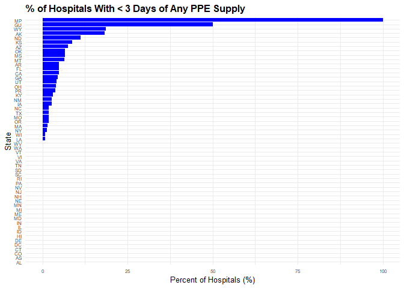
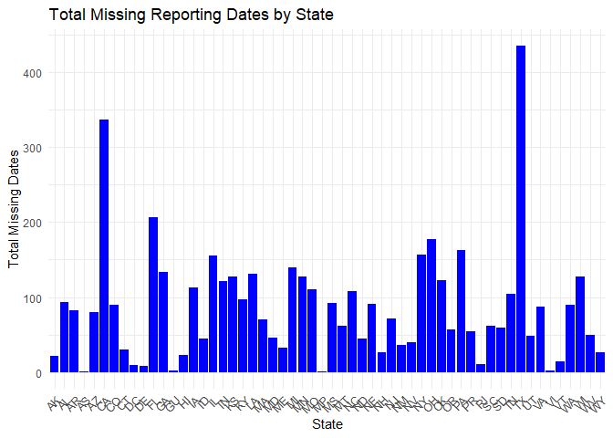
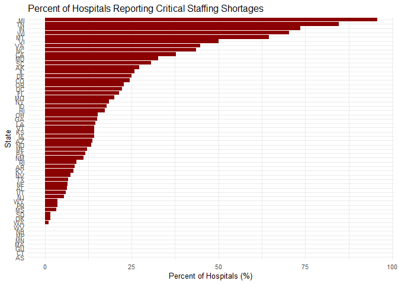

# Introduction

Understanding hospital capacity is essential for evaluating how health
systems respond to sustained pressure from infectious diseases such as
COVID-19 and seasonal influenza. During periods of high transmission,
hospitals face simultaneous stressors: shortages of ICU beds, limited
staffing, constrained supply chains, and wide variation in patient loads
across states. These factors influence not only patient outcomes but
also public-health decision-making, emergency planning, and resource
allocation.

In this report, We analyze U.S. hospital capacity and supply-chain
readiness using detailed, hospital-level public data from the U.S.
Department of Health and Human Services (HHS). Our goals are:

Describe the structure and contents of the dataset.

Quantify variation in COVID hospitalizations and ICU usage across
states.

Investigate supply chain stability, including N95, PPE, ventilator
supplies, and other critical resources.

Evaluate staffing shortages

Each section is organized around clear questions, with results supported
by carefully curated visualizations and tables.

# Question

How consistently were U.S. hospitals able to obtain critical supplies
such as N95 masks, PPE, and ventilators during periods of high patient
demand?

Were they shortages in supplies regarding  air related supplies like
respirators ?

Were there enough workers to manage demand ?

# About the Data

This dataset contains hospital reporting completeness information
collected weekly by the U.S. Department of Health and Human Services
(HHS). All hospitals licensed to provide 24-hour care in the United
States are required to submit operational and capacity data that support
the federal response to COVID-19. The reporting period covers Friday
through Thursday, and each row represents a single hospital’s submission
for that week (04-20-2024).

This information is essential for monitoring national hospital capacity,
supply readiness, and the overall quality of data used in federal
decision-making.

``` r
#Install Dependencies
library(tidyverse)
```

# Intial Exploration of the Data

``` r
#Load the DataSet
hospital <- read_csv("Data/Hospitcal_Coverage.csv")
```

``` r
#Inspect columns
dim(hospital)
```

    ## [1] 4852  146

``` r
str(hospital)
```

    ## spc_tbl_ [4,852 × 146] (S3: spec_tbl_df/tbl_df/tbl/data.frame)
    ##  $ State                                                              : chr [1:4852] "AK" "AK" "AK" "AK" ...
    ##  $ CCN                                                                : chr [1:4852] "020001" "020006" "020008" "020012" ...
    ##  $ Facility Name                                                      : chr [1:4852] "PROVIDENCE ALASKA MEDICAL CENTER" "MAT-SU REGIONAL MEDICAL CENTER" "BARTLETT REGIONAL HOSPITAL" "FAIRBANKS MEMORIAL HOSPITAL" ...
    ##  $ Street Address                                                     : chr [1:4852] "3200 PROVIDENCE DRIVE" "2500 SOUTH WOODWORTH LOOP" "3260 HOSPITAL DR" "1650 COWLES STREET" ...
    ##  $ City                                                               : chr [1:4852] "ANCHORAGE" "PALMER" "JUNEAU" "FAIRBANKS" ...
    ##  $ Zip Code                                                           : num [1:4852] 99508 99645 99801 99701 99508 ...
    ##  $ Fips Code                                                          : num [1:4852] 2020 2170 2110 2090 2020 2050 2120 2020 2260 2210 ...
    ##  $ Provider Subtype                                                   : chr [1:4852] "Short Term" "Short Term" "Short Term" "Short Term" ...
    ##  $ Reporting Source                                                   : chr [1:4852] "new_nhsn" "new_nhsn" "N/A" "new_nhsn" ...
    ##  $ Dates with Missing Data                                            : chr [1:4852] "[]" "['2024-03-27', '2024-04-03', '2024-04-10', '2024-04-11', '2024-04-12', '2024-04-13', '2024-04-14', '2024-04-15'"| __truncated__ "['2024-03-24', '2024-03-25', '2024-03-26', '2024-03-27', '2024-03-28', '2024-03-29', '2024-03-30', '2024-03-31'"| __truncated__ "[]" ...
    ##  $ Certified Bed Count                                                : num [1:4852] 401 74 57 162 250 50 49 167 11 6 ...
    ##  $ Component Hospitals                                                : num [1:4852] 1 1 NA 1 1 1 1 1 1 1 ...
    ##  $ Week Ending                                                        : Date[1:4852], format: "2024-04-20" "2024-04-20" ...
    ##  $ Days at 100%                                                       : num [1:4852] 28 15 0 28 28 28 28 28 28 26 ...
    ##  $ Percentage of Required Fields Reported                             : num [1:4852] 1 0.614 0 1 1 ...
    ##  $ Hospital Required to Report Wed Only                               : chr [1:4852] "No" "No" "No" "No" ...
    ##  $ County                                                             : chr [1:4852] "Anchorage" "Matanuska-Susitna" "Juneau" "Fairbanks North Star" ...
    ##  $ inpatient_beds                                                     : num [1:4852] 28 17 0 28 28 28 28 28 28 28 ...
    ##  $ all_adult_hospital_inpatient_beds                                  : num [1:4852] 28 17 0 28 28 28 28 28 28 28 ...
    ##  $ all_pediatric_inpatient_beds                                       : num [1:4852] 28 17 0 28 28 28 28 28 28 26 ...
    ##  $ inpatient_beds_used                                                : num [1:4852] 28 17 0 28 28 28 28 28 28 28 ...
    ##  $ all_adult_hospital_inpatient_bed_occupied                          : num [1:4852] 28 17 0 28 28 28 28 28 28 28 ...
    ##  $ all_pediatric_inpatient_bed_occupied                               : num [1:4852] 28 17 0 28 28 28 28 28 28 28 ...
    ##  $ total_icu_beds                                                     : num [1:4852] 28 17 0 28 28 28 28 28 28 28 ...
    ##  $ total_staffed_adult_icu_beds                                       : num [1:4852] 28 17 0 28 28 28 28 28 28 28 ...
    ##  $ total_staffed_pediatric_icu_beds                                   : num [1:4852] 28 17 0 28 28 28 28 28 28 26 ...
    ##  $ icu_beds_used                                                      : num [1:4852] 28 17 0 28 28 28 28 28 28 28 ...
    ##  $ staffed_adult_icu_bed_occupancy                                    : num [1:4852] 28 17 0 28 28 28 28 28 28 28 ...
    ##  $ staffed_pediatric_icu_bed_occupancy                                : num [1:4852] 28 17 0 28 28 28 28 28 28 28 ...
    ##  $ total_adult_patients_hospitalized_confirmed_covid                  : num [1:4852] 28 17 0 28 28 28 28 28 28 28 ...
    ##  $ total_pediatric_patients_hospitalized_confirmed_covid              : num [1:4852] 28 17 0 28 28 28 28 28 28 28 ...
    ##  $ staffed_icu_adult_patients_confirmed_covid                         : num [1:4852] 28 17 0 28 28 28 28 28 28 28 ...
    ##  $ staffed_icu_pediatric_patients_confirmed_covid                     : num [1:4852] 28 17 0 28 28 28 28 28 28 28 ...
    ##  $ previous_day_admission_adult_covid_confirmed                       : num [1:4852] 28 17 0 28 28 28 28 28 28 28 ...
    ##  $ previous_day_admission_adult_covid_confirmed_all                   : num [1:4852] 28 17 0 28 28 28 28 28 28 28 ...
    ##  $ previous_day_admission_pediatric_covid_confirmed                   : num [1:4852] 28 17 0 28 28 28 28 28 28 28 ...
    ##  $ previous_day_admission_peds_covid_confirmed_all                    : num [1:4852] 28 17 0 28 28 28 28 28 28 28 ...
    ##  $ total_patients_hospitalized_confirmed_influenza                    : num [1:4852] 28 17 0 28 28 28 28 28 28 28 ...
    ##  $ previous_day_admission_influenza_confirmed                         : num [1:4852] 28 17 0 28 28 28 28 28 28 28 ...
    ##  $ icu_patients_confirmed_influenza                                   : num [1:4852] 28 17 0 28 28 28 28 28 28 28 ...
    ##  $ n95_respirators_days_available                                     : num [1:4852] 4 0 0 4 4 4 4 4 4 4 ...
    ##  $ on_hand_supply_of_surgical_masks_in_days                           : num [1:4852] 4 0 0 4 4 4 4 4 4 4 ...
    ##  $ on_hand_supply_of_eye_protection_in_days                           : num [1:4852] 4 0 0 4 4 4 4 4 4 4 ...
    ##  $ on_hand_supply_of_single_use_surgical_gowns_in_days                : num [1:4852] 4 0 0 4 4 4 4 4 4 4 ...
    ##  $ on_hand_supply_of_gloves_in_days                                   : num [1:4852] 4 0 0 4 4 4 4 4 4 4 ...
    ##  $ able_to_maintain_n95_masks                                         : num [1:4852] 4 0 0 4 4 4 4 4 4 4 ...
    ##  $ able_to_maintain_surgical_masks                                    : num [1:4852] 4 0 0 4 4 4 4 4 4 4 ...
    ##  $ able_to_maintain_eye_protection                                    : num [1:4852] 4 0 0 4 4 4 4 4 4 4 ...
    ##  $ able_to_maintain_single_use_gowns                                  : num [1:4852] 4 0 0 4 4 4 4 4 4 4 ...
    ##  $ able_to_maintain_gloves                                            : num [1:4852] 4 0 0 4 4 4 4 4 4 4 ...
    ##  $ total_adult_patients_hospitalized_confirmed_and_suspected_covid    : num [1:4852] 28 17 0 0 28 6 0 0 28 28 ...
    ##  $ total_pediatric_patients_hospitalized_confirmed_and_suspected_covid: num [1:4852] 28 17 0 0 28 6 0 0 28 28 ...
    ##  $ inpatient_ventilators_used_covid                                   : num [1:4852] 28 17 0 0 28 6 0 0 28 28 ...
    ##  $ staffed_icu_adult_patients_confirmed_and_suspected_covid           : num [1:4852] 28 17 0 0 28 6 0 0 28 28 ...
    ##  $ hospital_onset_covid                                               : num [1:4852] 28 17 0 0 28 0 0 0 28 28 ...
    ##  $ previous_day_admission_adult_covid_suspected                       : num [1:4852] 28 17 0 0 28 1 0 0 28 28 ...
    ##  $ previous_day_admission_adult_covid_suspected_all                   : num [1:4852] 28 17 0 0 28 1 0 0 28 28 ...
    ##  $ previous_day_admission_pediatric_covid_suspected                   : num [1:4852] 28 17 0 0 28 0 0 0 28 28 ...
    ##  $ previous_day_total_ED_visits                                       : num [1:4852] 28 17 0 0 28 0 0 0 28 28 ...
    ##  $ previous_day_covid_ED_visits                                       : num [1:4852] 28 17 0 0 28 0 0 0 28 28 ...
    ##  $ total_adult_patients_hospitalized_confirmed_influenza              : num [1:4852] 0 0 0 0 0 21 0 0 0 0 ...
    ##  $ total_pediatric_patients_hospitalized_confirmed_influenza          : num [1:4852] 0 0 0 0 0 21 0 0 0 0 ...
    ##  $ previous_day_admission_adult_influenza_confirmed                   : num [1:4852] 0 0 0 0 0 21 0 0 0 0 ...
    ##  $ previous_day_admission_pediatric_influenza_confirmed               : num [1:4852] 0 0 0 0 0 21 0 0 0 0 ...
    ##  $ staffed_icu_adult_patients_confirmed_influenza                     : num [1:4852] 0 0 0 0 0 21 0 0 0 0 ...
    ##  $ staffed_icu_pediatric_patients_confirmed_influenza                 : num [1:4852] 0 0 0 0 0 21 0 0 0 0 ...
    ##  $ total_adult_patients_hospitalized_confirmed_rsv                    : num [1:4852] 0 0 0 0 0 20 0 0 0 0 ...
    ##  $ total_pediatric_patients_hospitalized_confirmed_rsv                : num [1:4852] 0 0 0 0 0 20 0 0 0 0 ...
    ##  $ previous_day_admission_adult_rsv_confirmed                         : num [1:4852] 0 0 0 0 0 20 0 0 0 0 ...
    ##  $ previous_day_admission_pediatric_rsv_confirmed                     : num [1:4852] 0 0 0 0 0 20 0 0 0 0 ...
    ##  $ staffed_icu_adult_patients_confirmed_rsv                           : num [1:4852] 0 0 0 0 0 20 0 0 0 0 ...
    ##  $ staffed_icu_pediatric_patients_confirmed_rsv                       : num [1:4852] 0 0 0 0 0 20 0 0 0 0 ...
    ##  $ critical_staffing_shortage_anticipated_within_week                 : num [1:4852] 4 0 0 4 0 4 4 4 4 4 ...
    ##  $ previous_day_admission_adult_covid_suspected_18-19                 : num [1:4852] 28 17 0 0 28 0 0 0 28 28 ...
    ##  $ previous_day_admission_adult_covid_suspected_20-29                 : num [1:4852] 28 17 0 0 28 0 0 0 28 28 ...
    ##  $ previous_day_admission_adult_covid_suspected_30-39                 : num [1:4852] 28 17 0 0 28 0 0 0 28 28 ...
    ##  $ previous_day_admission_adult_covid_suspected_40-49                 : num [1:4852] 28 17 0 0 28 1 0 0 28 28 ...
    ##  $ previous_day_admission_adult_covid_suspected_50-59                 : num [1:4852] 28 17 0 0 28 0 0 0 28 28 ...
    ##  $ previous_day_admission_adult_covid_suspected_60-69                 : num [1:4852] 28 17 0 0 28 0 0 0 28 28 ...
    ##  $ previous_day_admission_adult_covid_suspected_70-79                 : num [1:4852] 28 17 0 0 28 0 0 0 28 28 ...
    ##  $ previous_day_admission_adult_covid_suspected_80+                   : num [1:4852] 28 17 0 0 28 0 0 0 28 28 ...
    ##  $ previous_day_admission_adult_covid_suspected_unknown               : num [1:4852] 28 17 0 0 28 1 0 0 28 28 ...
    ##  $ previous_day_admission_adult_covid_confirmed_18-19                 : num [1:4852] 28 17 0 28 28 28 28 26 28 28 ...
    ##  $ previous_day_admission_adult_covid_confirmed_20-29                 : num [1:4852] 28 17 0 28 28 28 28 1 28 28 ...
    ##  $ previous_day_admission_adult_covid_confirmed_30-39                 : num [1:4852] 28 17 0 28 28 28 28 0 28 28 ...
    ##  $ previous_day_admission_adult_covid_confirmed_40-49                 : num [1:4852] 28 17 0 28 28 28 28 0 28 28 ...
    ##  $ previous_day_admission_adult_covid_confirmed_50-59                 : num [1:4852] 28 17 0 28 28 28 28 0 28 28 ...
    ##  $ previous_day_admission_adult_covid_confirmed_60-69                 : num [1:4852] 28 17 0 28 28 28 28 1 28 28 ...
    ##  $ previous_day_admission_adult_covid_confirmed_70-79                 : num [1:4852] 28 17 0 28 28 28 28 0 28 28 ...
    ##  $ previous_day_admission_adult_covid_confirmed_80+                   : num [1:4852] 28 17 0 28 28 28 28 0 28 28 ...
    ##  $ previous_day_admission_adult_covid_confirmed_unknown               : num [1:4852] 28 17 0 28 28 28 28 28 28 28 ...
    ##  $ previous_day_admission_pediatric_covid_confirmed_0_4               : num [1:4852] 28 17 0 28 28 28 28 28 28 28 ...
    ##  $ previous_day_admission_pediatric_covid_confirmed_5_11              : num [1:4852] 28 17 0 28 28 28 28 0 28 28 ...
    ##  $ previous_day_admission_pediatric_covid_confirmed_12_17             : num [1:4852] 28 17 0 28 28 28 28 0 28 28 ...
    ##  $ previous_day_admission_pediatric_covid_confirmed_unknown           : num [1:4852] 28 17 0 28 28 28 28 28 28 28 ...
    ##  $ total_beds                                                         : num [1:4852] 28 0 0 0 28 0 0 0 28 28 ...
    ##  $ all_adult_hospital_beds                                            : num [1:4852] 28 0 0 0 28 0 0 0 28 28 ...
    ##  $ total_ventilators                                                  : num [1:4852] 28 0 0 0 28 0 0 0 28 28 ...
    ##  $ ventilators_used                                                   : num [1:4852] 28 0 0 0 28 0 0 0 28 28 ...
    ##   [list output truncated]
    ##  - attr(*, "spec")=
    ##   .. cols(
    ##   ..   State = col_character(),
    ##   ..   CCN = col_character(),
    ##   ..   `Facility Name` = col_character(),
    ##   ..   `Street Address` = col_character(),
    ##   ..   City = col_character(),
    ##   ..   `Zip Code` = col_double(),
    ##   ..   `Fips Code` = col_double(),
    ##   ..   `Provider Subtype` = col_character(),
    ##   ..   `Reporting Source` = col_character(),
    ##   ..   `Dates with Missing Data` = col_character(),
    ##   ..   `Certified Bed Count` = col_double(),
    ##   ..   `Component Hospitals` = col_double(),
    ##   ..   `Week Ending` = col_date(format = ""),
    ##   ..   `Days at 100%` = col_double(),
    ##   ..   `Percentage of Required Fields Reported` = col_double(),
    ##   ..   `Hospital Required to Report Wed Only` = col_character(),
    ##   ..   County = col_character(),
    ##   ..   inpatient_beds = col_double(),
    ##   ..   all_adult_hospital_inpatient_beds = col_double(),
    ##   ..   all_pediatric_inpatient_beds = col_double(),
    ##   ..   inpatient_beds_used = col_double(),
    ##   ..   all_adult_hospital_inpatient_bed_occupied = col_double(),
    ##   ..   all_pediatric_inpatient_bed_occupied = col_double(),
    ##   ..   total_icu_beds = col_double(),
    ##   ..   total_staffed_adult_icu_beds = col_double(),
    ##   ..   total_staffed_pediatric_icu_beds = col_double(),
    ##   ..   icu_beds_used = col_double(),
    ##   ..   staffed_adult_icu_bed_occupancy = col_double(),
    ##   ..   staffed_pediatric_icu_bed_occupancy = col_double(),
    ##   ..   total_adult_patients_hospitalized_confirmed_covid = col_double(),
    ##   ..   total_pediatric_patients_hospitalized_confirmed_covid = col_double(),
    ##   ..   staffed_icu_adult_patients_confirmed_covid = col_double(),
    ##   ..   staffed_icu_pediatric_patients_confirmed_covid = col_double(),
    ##   ..   previous_day_admission_adult_covid_confirmed = col_double(),
    ##   ..   previous_day_admission_adult_covid_confirmed_all = col_double(),
    ##   ..   previous_day_admission_pediatric_covid_confirmed = col_double(),
    ##   ..   previous_day_admission_peds_covid_confirmed_all = col_double(),
    ##   ..   total_patients_hospitalized_confirmed_influenza = col_double(),
    ##   ..   previous_day_admission_influenza_confirmed = col_double(),
    ##   ..   icu_patients_confirmed_influenza = col_double(),
    ##   ..   n95_respirators_days_available = col_double(),
    ##   ..   on_hand_supply_of_surgical_masks_in_days = col_double(),
    ##   ..   on_hand_supply_of_eye_protection_in_days = col_double(),
    ##   ..   on_hand_supply_of_single_use_surgical_gowns_in_days = col_double(),
    ##   ..   on_hand_supply_of_gloves_in_days = col_double(),
    ##   ..   able_to_maintain_n95_masks = col_double(),
    ##   ..   able_to_maintain_surgical_masks = col_double(),
    ##   ..   able_to_maintain_eye_protection = col_double(),
    ##   ..   able_to_maintain_single_use_gowns = col_double(),
    ##   ..   able_to_maintain_gloves = col_double(),
    ##   ..   total_adult_patients_hospitalized_confirmed_and_suspected_covid = col_double(),
    ##   ..   total_pediatric_patients_hospitalized_confirmed_and_suspected_covid = col_double(),
    ##   ..   inpatient_ventilators_used_covid = col_double(),
    ##   ..   staffed_icu_adult_patients_confirmed_and_suspected_covid = col_double(),
    ##   ..   hospital_onset_covid = col_double(),
    ##   ..   previous_day_admission_adult_covid_suspected = col_double(),
    ##   ..   previous_day_admission_adult_covid_suspected_all = col_double(),
    ##   ..   previous_day_admission_pediatric_covid_suspected = col_double(),
    ##   ..   previous_day_total_ED_visits = col_double(),
    ##   ..   previous_day_covid_ED_visits = col_double(),
    ##   ..   total_adult_patients_hospitalized_confirmed_influenza = col_double(),
    ##   ..   total_pediatric_patients_hospitalized_confirmed_influenza = col_double(),
    ##   ..   previous_day_admission_adult_influenza_confirmed = col_double(),
    ##   ..   previous_day_admission_pediatric_influenza_confirmed = col_double(),
    ##   ..   staffed_icu_adult_patients_confirmed_influenza = col_double(),
    ##   ..   staffed_icu_pediatric_patients_confirmed_influenza = col_double(),
    ##   ..   total_adult_patients_hospitalized_confirmed_rsv = col_double(),
    ##   ..   total_pediatric_patients_hospitalized_confirmed_rsv = col_double(),
    ##   ..   previous_day_admission_adult_rsv_confirmed = col_double(),
    ##   ..   previous_day_admission_pediatric_rsv_confirmed = col_double(),
    ##   ..   staffed_icu_adult_patients_confirmed_rsv = col_double(),
    ##   ..   staffed_icu_pediatric_patients_confirmed_rsv = col_double(),
    ##   ..   critical_staffing_shortage_anticipated_within_week = col_double(),
    ##   ..   `previous_day_admission_adult_covid_suspected_18-19` = col_double(),
    ##   ..   `previous_day_admission_adult_covid_suspected_20-29` = col_double(),
    ##   ..   `previous_day_admission_adult_covid_suspected_30-39` = col_double(),
    ##   ..   `previous_day_admission_adult_covid_suspected_40-49` = col_double(),
    ##   ..   `previous_day_admission_adult_covid_suspected_50-59` = col_double(),
    ##   ..   `previous_day_admission_adult_covid_suspected_60-69` = col_double(),
    ##   ..   `previous_day_admission_adult_covid_suspected_70-79` = col_double(),
    ##   ..   `previous_day_admission_adult_covid_suspected_80+` = col_double(),
    ##   ..   previous_day_admission_adult_covid_suspected_unknown = col_double(),
    ##   ..   `previous_day_admission_adult_covid_confirmed_18-19` = col_double(),
    ##   ..   `previous_day_admission_adult_covid_confirmed_20-29` = col_double(),
    ##   ..   `previous_day_admission_adult_covid_confirmed_30-39` = col_double(),
    ##   ..   `previous_day_admission_adult_covid_confirmed_40-49` = col_double(),
    ##   ..   `previous_day_admission_adult_covid_confirmed_50-59` = col_double(),
    ##   ..   `previous_day_admission_adult_covid_confirmed_60-69` = col_double(),
    ##   ..   `previous_day_admission_adult_covid_confirmed_70-79` = col_double(),
    ##   ..   `previous_day_admission_adult_covid_confirmed_80+` = col_double(),
    ##   ..   previous_day_admission_adult_covid_confirmed_unknown = col_double(),
    ##   ..   previous_day_admission_pediatric_covid_confirmed_0_4 = col_double(),
    ##   ..   previous_day_admission_pediatric_covid_confirmed_5_11 = col_double(),
    ##   ..   previous_day_admission_pediatric_covid_confirmed_12_17 = col_double(),
    ##   ..   previous_day_admission_pediatric_covid_confirmed_unknown = col_double(),
    ##   ..   total_beds = col_double(),
    ##   ..   all_adult_hospital_beds = col_double(),
    ##   ..   total_ventilators = col_double(),
    ##   ..   ventilators_used = col_double(),
    ##   ..   overflow_covid = col_double(),
    ##   ..   overflow_ventilators_used_covid = col_double(),
    ##   ..   deaths_covid = col_double(),
    ##   ..   previous_day_remdesivir_used = col_double(),
    ##   ..   on_hand_supply_remdesivir_vials = col_double(),
    ##   ..   critical_staffing_shortage_today = col_double(),
    ##   ..   staffing_shortage_details = col_double(),
    ##   ..   total_patients_hospitalized_confirmed_influenza_and_covid = col_double(),
    ##   ..   previous_day_deaths_influenza = col_double(),
    ##   ..   previous_day_deaths_covid_and_influenza = col_double(),
    ##   ..   PPE_supply_management_source = col_double(),
    ##   ..   on_hand_ventilator_supplies_in_days = col_double(),
    ##   ..   on_hand_supply_of_n95_respirators_in_units = col_double(),
    ##   ..   on_hand_supply_of_PAPR_in_units = col_double(),
    ##   ..   on_hand_supply_of_surgical_masks_in_units = col_double(),
    ##   ..   on_hand_supply_of_eye_protection_in_units = col_double(),
    ##   ..   on_hand_supply_of_single_use_surgical_gowns_in_units = col_double(),
    ##   ..   on_hand_supply_of_launderable_surgical_gowns_in_units = col_double(),
    ##   ..   on_hand_supply_of_gloves_in_units = col_double(),
    ##   ..   able_to_obtain_ventilator_supplies = col_double(),
    ##   ..   able_to_obtain_ventilator_medications = col_double(),
    ##   ..   able_to_obtain_n95_masks = col_double(),
    ##   ..   able_to_obtain_PAPRs = col_double(),
    ##   ..   able_to_obtain_surgical_masks = col_double(),
    ##   ..   able_to_obtain_eye_protection = col_double(),
    ##   ..   able_to_obtain_single_use_gowns = col_double(),
    ##   ..   able_to_obtain_gloves = col_double(),
    ##   ..   able_to_obtain_launderable_gowns = col_double(),
    ##   ..   able_to_maintain_ventilator_supplies = col_double(),
    ##   ..   able_to_maintain_ventilator_medications = col_double(),
    ##   ..   able_to_maintain_PAPRs = col_double(),
    ##   ..   able_to_maintain_lab_nasal_pharyngeal_swabs = col_double(),
    ##   ..   able_to_maintain_lab_nasal_swabs = col_double(),
    ##   ..   able_to_maintain_lab_viral_transport_media = col_double(),
    ##   ..   reusable_isolation_gowns_used = col_double(),
    ##   ..   reusable_PAPRs_or_elastomerics_used = col_double(),
    ##   ..   reusable_n95_masks_used = col_double(),
    ##   ..   anticipated_medical_supply_medication_shortages = col_double(),
    ##   ..   on_hand_supply_therapeutic_b_bamlanivimab_courses = col_double(),
    ##   ..   previous_week_therapeutic_b_bamlanivimab_courses_used = col_double(),
    ##   ..   previous_week_personnel_covid_vaccinated_doses_administered = col_double(),
    ##   ..   total_personnel_covid_vaccinated_doses_none = col_double(),
    ##   ..   total_personnel_covid_vaccinated_doses_one = col_double(),
    ##   ..   total_personnel_covid_vaccinated_doses_all = col_double(),
    ##   ..   total_personnel = col_double(),
    ##   ..   previous_week_patients_covid_vaccinated_doses_one = col_double(),
    ##   ..   previous_week_patients_covid_vaccinated_doses_all = col_double()
    ##   .. )
    ##  - attr(*, "problems")=<externalptr>

This dataset contains weekly reports from hospitals across the U.S.
showing their capacity, resources, and equipment availability during a
given reporting period. Each row represents one hospital’s report for
one week.

1.  Hospital Identification

These columns tell you which hospital the row refers to. State – U.S.
state the hospital is in. Facility Name – Name of the hospital. Street
Address, City, Zip Code, County – Location information. Fips Code –
Geographic code used for counties

2.  Reporting Info

These describe the timing and quality of the reporting. Week Ending –
The date that week’s data ends. Days at 100% – Number of days the
hospital reported being at full capacity. Percentage of Required Fields
Reported – How complete their report was. Reporting Source / Provider
Subtype – Who submitted it and what type of facility it is.

3.  Bed Capacity

These fields describe how many beds the hospital has and how many are
being used. Common examples from your dataset include: inpatient_beds –
Total hospital beds. inpatient_beds_used – Beds currently occupied.
icu_beds – Total ICU beds. icu_beds_used – ICU beds currently occupied.
adult_icu_bed_utilization – Percent of ICU beds in use.
staffed_adult_icu_beds – ICU beds that have staff available. These
numbers tell you how strained the hospital is.

4.  COVID-Related Metrics

These show the level of COVID burden on the hospital.
total_adult_patients_hospitalized_confirmed_covid.
inpatient_beds_used_covid. icu_patients_confirmed_covid. These numbers
capture COVID’s impact on hospital resources.

5.  Equipment Availability

These columns show how many days the hospital has supplies for:
n95_respirators_days_available, surgical_masks_days_available,
ventilator_supplies_days_available, eye_protection_days_available,
PAPR_days_available, single_use_gowns_days_available,
ventilator_medications_days_available. These indicate how close a
hospital is to running out of critical PPE or equipment.

6.  Staffing & Operations

Some hospitals also report: number_of_travel_nurses_requested,
staff_shortage_today, emergency_department_status. These describe
operational strain.

# Data Cleaning

``` r
#Convert ZIP and Fips to character
hospital <- hospital |>
  mutate(
    `Zip Code` = as.character(`Zip Code`),
    `Fips Code` = as.character(`Fips Code`)
  )
```

``` r
#Replace empty strings with NA
hospital <- hospital |>
  mutate(
    across(where(is.character), ~ na_if(.x, ""))
  )
```

``` r
# Convert Week Ending to Date
hospital$`Week Ending` <- as.Date(hospital$`Week Ending`)

# Convert CCN to character (hospital ID)
hospital$CCN <- as.character(hospital$CCN)

# Convert Certified Bed Count to numeric
hospital$`Certified Bed Count` <- as.numeric(hospital$`Certified Bed Count`)

# Convert Days at 100% to numeric
hospital$`Days at 100%` <- as.numeric(hospital$`Days at 100%`)

# Convert Percentage of Required Fields Reported to numeric
hospital$`Percentage of Required Fields Reported` <- as.numeric(hospital$`Percentage of Required Fields Reported`)

# Convert the big block of obvious numeric columns
numeric_cols <- c(
  "inpatient_beds", "all_adult_hospital_inpatient_beds",
  "all_pediatric_inpatient_beds", "inpatient_beds_used",
  "all_adult_hospital_inpatient_bed_occupied",
  "all_pediatric_inpatient_bed_occupied", "total_icu_beds",
  "total_staffed_adult_icu_beds", "total_staffed_pediatric_icu_beds",
  "icu_beds_used", "staffed_adult_icu_bed_occupancy",
  "staffed_pediatric_icu_bed_occupancy",
  "total_adult_patients_hospitalized_confirmed_covid",
  "total_pediatric_patients_hospitalized_confirmed_covid",
  "staffed_icu_adult_patients_confirmed_covid",
  "staffed_icu_pediatric_patients_confirmed_covid",
  "previous_day_admission_adult_covid_confirmed",
  "previous_day_admission_adult_covid_confirmed_all",
  "previous_day_admission_pediatric_covid_confirmed",
  "previous_day_admission_peds_covid_confirmed_all",
  "total_patients_hospitalized_confirmed_influenza",
  "previous_day_admission_influenza_confirmed",
  "icu_patients_confirmed_influenza",
  "n95_respirators_days_available",
  "on_hand_supply_of_surgical_masks_in_days",
  "on_hand_supply_of_eye_protection_in_days",
  "on_hand_supply_of_single_use_surgical_gowns_in_days",
  "on_hand_supply_of_gloves_in_days"
)

hospital[numeric_cols] <- lapply(hospital[numeric_cols], as.numeric)

# Convert logical (Yes/No) supply/ability columns
logical_cols <- c(
  "able_to_maintain_n95_masks",
  "able_to_maintain_surgical_masks",
  "able_to_maintain_eye_protection",
  "able_to_maintain_single_use_gowns",
  "able_to_maintain_gloves"
)

hospital[logical_cols] <- lapply(hospital[logical_cols], as.logical)

hospital <- hospital |> mutate(`Week Ending` = as.Date(`Week Ending`))
```

``` r
#Save Cleaned Dataset
write_csv(hospital, "Data/cleaned_Hospital_Coverage.csv")
```

The dataset was cleaned to ensure accuracy, consistency, and proper
formatting before analysis. ZIP Codes, FIPS Codes, and hospital
identifiers were converted to character fields. Empty strings across all
character variables were replaced with NA to correctly represent missing
data. All date fields were converted into proper date formats, and
numerous hospital capacity, occupancy, and supply-related columns were
converted to numeric types. Several Yes/No fields were also converted
into logical values to support clearer interpretation. Finally, the
fully cleaned dataset was exported as a new file,

# Graphs & Tables

``` r
#Use Cleaned Dataset
hospital <- read_csv("Data/cleaned_Hospital_Coverage.csv")
```

    ## Rows: 4852 Columns: 146
    ## ── Column specification ────────────────────────────────────────────────────────
    ## Delimiter: ","
    ## chr   (10): State, CCN, Facility Name, Street Address, City, Provider Subtyp...
    ## dbl  (130): Zip Code, Fips Code, Certified Bed Count, Component Hospitals, D...
    ## lgl    (5): able_to_maintain_n95_masks, able_to_maintain_surgical_masks, abl...
    ## date   (1): Week Ending
    ## 
    ## ℹ Use `spec()` to retrieve the full column specification for this data.
    ## ℹ Specify the column types or set `show_col_types = FALSE` to quiet this message.

``` r
hospital |>
  group_by(State) |>
  summarize(
    total_covid = sum(
      total_adult_patients_hospitalized_confirmed_covid +
      total_pediatric_patients_hospitalized_confirmed_covid,
      na.rm = TRUE
    )
  ) |>
  ggplot(aes(x = reorder(State, total_covid), y = total_covid)) +
  geom_col(fill = "steelblue") +
  coord_flip() +
  labs(
    title = "Total Current COVID Hospitalizations by State",
    x = "State",
    y = "Total Hospitalized COVID Patients"
  ) +
  theme_minimal()
```

<!-- -->

The bar chart compares the total number of hospitalized COVID-19
patients across U.S. states.A small group of states accounts for a large
share of COVID-19 hospitalizations. The top few states—likely those with
the largest populations or ongoing outbreaks—show totals exceeding
15,000–20,000 hospitalized patients, dramatically higher than the rest
of the country. After the top tier, hospitalization totals drop off
steadily, forming a long downward slope, which suggests that most states
have considerably lower hospitalization burdens.

``` r
hospital %>%
  mutate(
    covid_total = total_adult_patients_hospitalized_confirmed_covid +
                  total_pediatric_patients_hospitalized_confirmed_covid
  ) %>%
  ggplot(aes(x = State, y = covid_total)) +
  geom_boxplot(fill = "skyblue") +
  coord_flip() +
  labs(
    title = "Boxplot of COVID Hospitalizations by State",
    x = "State",
    y = "COVID Hospitalizations"
  ) +
  theme_minimal()
```

<!-- -->

Most states show low and tightly clustered hospitalization counts, with
medians falling between 0 and 20 patients. This suggests that for many
hospitals, COVID-19 admissions were consistently low during the
reporting period. However, several states exhibit much wider spreads and
higher medians, indicating greater hospitalization burdens. The states
with longer boxes (larger interquartile ranges) or many high-value
outliers are those experiencing more variable or elevated COVID impacts.

``` r
hospital %>%
  group_by(State) %>%
  summarize(icu_used = sum(icu_beds_used, na.rm = TRUE)) %>%
  ggplot(aes(x = reorder(State, icu_used), y = icu_used)) +
  geom_col(fill = "firebrick") +
  coord_flip() +
  labs(
    title = "ICU Beds Used by State (Week Ending 2024-04-20)",
    x = "State",
    y = "ICU Beds Used"
  ) +
  theme_minimal()
```

<!-- -->

The Bar graphs show the ICU beds used per state. it is directly
proportional to the bar graph with the number of hospital admissions for
COVID, since those will be the states with the most ICU beds used. The
states with the high demand of beds could be the one’s that could
experience shortage of supplies due to the demand, but they could also
be the ones that could have plenty of supplies due to

``` r
# Top 5 best-supplied states
best_states <- hospital %>%
  group_by(State) %>%
  summarize(avg_n95 = mean(n95_respirators_days_available, na.rm = TRUE)) %>%
  arrange(desc(avg_n95)) %>%
  slice(1:5)

best_states
```

    ## # A tibble: 5 × 2
    ##   State avg_n95
    ##   <chr>   <dbl>
    ## 1 AL          4
    ## 2 AS          4
    ## 3 CO          4
    ## 4 CT          4
    ## 5 DE          4

``` r
# Top 5 worst-supplied states
worst_states <- hospital %>%
  group_by(State) %>%
  summarize(avg_n95 = mean(n95_respirators_days_available, na.rm = TRUE)) %>%
  arrange(avg_n95) %>%
  slice(1:5)

worst_states
```

    ## # A tibble: 5 × 2
    ##   State avg_n95
    ##   <chr>   <dbl>
    ## 1 MP       0   
    ## 2 GU       3   
    ## 3 AK       3.32
    ## 4 WY       3.33
    ## 5 VI       3.5

The two tables show which states were the best supplied in terms of
having respirators versus the worst. An interesting note is that the
hospitals with the most patients do not appear in the worst states.
Typically busy hospitals could experience shortage, but in this case it
does not. Rather, the trend seems to be pointing towards hospitals that
didn’t expect an increase in demand

``` r
hospital |>
  group_by(State) |>
  summarise(shortage_rate = mean(critical_staffing_shortage_today, na.rm = TRUE)) |>
  ggplot(aes(x = reorder(State, shortage_rate), y = shortage_rate)) +
  geom_col(fill = "firebrick") +
  coord_flip() +
  labs(
    title = "Rate of Critical Staffing Shortages by State",
    x = "State",
    y = "Shortage Rate"
  ) +
  theme_minimal()
```

<!-- -->

This bar chart shows how frequently hospitals in each state reported
critical staffing shortages. The states are ordered from highest to
lowest shortage rate, making it easy to identify where staffing strain
is most severe.A small group of states stands out with high shortage
rates, with the top state reporting a value above 25, indicating
widespread staffing challenges across its hospitals. Several other
states report values between 10 and 20, suggesting persistent
difficulties maintaining adequate staffing levels.

``` r
library(tidyverse)

obtain_vars <- hospital |>
  select(
    able_to_obtain_ventilator_supplies,
    able_to_obtain_ventilator_medications,
    able_to_obtain_n95_masks,
    able_to_obtain_PAPRs,
    able_to_obtain_surgical_masks,
    able_to_obtain_eye_protection,
    able_to_obtain_single_use_gowns,
    able_to_obtain_gloves,
    able_to_obtain_launderable_gowns
  ) |>
  pivot_longer(everything(), names_to = "supply", values_to = "available")

obtain_vars |>
  group_by(supply) |>
  summarise(rate = mean(available, na.rm = TRUE)) |>
  ggplot(aes(x = reorder(supply, rate), y = rate)) +
  geom_col(fill = "steelblue") +
  coord_flip() +
  labs(
    title = "Rate of Hospitals Able to Obtain Supplies",
    x = "Supply Type",
    y = "Proportion of Hospitals"
  ) +
  theme_minimal()
```

<!-- -->

The first chart shows the proportion of hospitals that are able to
obtain key medical supplies when needed. Across nearly all supply
categories—such as single-use gowns, eye protection, gloves, N95 masks,
and surgical masks—the ability to obtain supplies is extremely high,
with proportions near 1.0, meaning almost all hospitals report being
able to acquire these items. This suggests that supply chains for
standard PPE have largely stabilized.

``` r
maintain_vars <- hospital |>
  select(
    able_to_maintain_ventilator_supplies,
    able_to_maintain_ventilator_medications,
    able_to_maintain_PAPRs,
    able_to_maintain_lab_nasal_pharyngeal_swabs,
    able_to_maintain_lab_nasal_swabs,
    able_to_maintain_lab_viral_transport_media
  ) |>
  pivot_longer(everything(), names_to = "supply", values_to = "maintainable")

maintain_vars |>
  group_by(supply) |>
  summarise(rate = mean(maintainable, na.rm = TRUE)) |>
  ggplot(aes(x = reorder(supply, rate), y = rate)) +
  geom_col(fill = "darkgreen") +
  coord_flip() +
  labs(
    title = "Rate of Hospitals Able to Maintain Supplies",
    x = "Supply Type",
    y = "Proportion of Hospitals"
  ) +
  theme_minimal()
```

<!-- -->

The second chart evaluates whether hospitals are able to maintain
adequate ongoing supplies—not just obtain them once. Here, the rates are
slightly lower overall than the “able to obtain” chart, which is
expected since maintaining a steady inventory requires consistent supply
streams and adequate on-hand stock.

``` r
df_low_ppe <- hospital %>%
  mutate(
    low_ppe = (
      n95_respirators_days_available < 3 |
      on_hand_supply_of_surgical_masks_in_days < 3 |
      on_hand_supply_of_eye_protection_in_days < 3 |
      on_hand_supply_of_single_use_surgical_gowns_in_days < 3 |
      on_hand_supply_of_gloves_in_days < 3
    )
  ) %>%
  group_by(State) %>%
  summarize(
    percent_low = mean(low_ppe, na.rm = TRUE) * 100,
    n = n()
  ) %>%
  arrange(desc(percent_low))

ggplot(df_low_ppe, aes(x = reorder(State, percent_low), y = percent_low)) +
  geom_col(fill = "blue") +
  coord_flip() +
  labs(
    title = "% of Hospitals With < 3 Days of Any PPE Supply",
    x = "State",
    y = "Percent of Hospitals (%)"
  ) +
  theme_minimal(base_size = 10) +
  theme(
    plot.title = element_text(face = "bold", size = 12),
    axis.text.y = element_text(size = 6),
    axis.text.x = element_text(size = 6)
  )
```

<!-- --> The chart
shows the percentage of hospitals in each U.S. state that reported
having fewer than three days’ worth of any essential PPE supply. States
are ranked from highest to lowest percentage, allowing a clear
comparison of supply vulnerabilities across the country.The states at
the top of the chart have the largest share of hospitals with extremely
limited PPE reserves, indicating higher supply-chain strain or greater
demand surges. As we move down the chart, the percentages decline,
showing states where hospitals were better able to maintain adequate PPE
inventories.

``` r
df_missing <- hospital %>%
  mutate(missing_count = lengths(`Dates with Missing Data`)) %>%
  group_by(State) %>%
  summarise(total_missing_dates = sum(missing_count, na.rm = TRUE),
            hospitals_reporting = n())

ggplot(df_missing, aes(x = State, y = total_missing_dates)) +
  geom_bar(stat = "identity", fill = "blue") +
  labs(
    title = "Total Missing Reporting Dates by State",
    x = "State",
    y = "Total Missing Dates"
  ) +
  theme_minimal() +

  theme(axis.text.x = element_text(angle = 45, hjust = 1))
```

<!-- -->

``` r
  theme(
    axis.text.y = element_blank(),
    axis.ticks.y = element_blank(),
    axis.text.x = element_text(angle = 90, vjust = 0.5),
    panel.grid = element_blank()
  )
```

    ## <theme> List of 4
    ##  $ axis.text.x : <ggplot2::element_text>
    ##   ..@ family       : NULL
    ##   ..@ face         : NULL
    ##   ..@ italic       : chr NA
    ##   ..@ fontweight   : num NA
    ##   ..@ fontwidth    : num NA
    ##   ..@ colour       : NULL
    ##   ..@ size         : NULL
    ##   ..@ hjust        : NULL
    ##   ..@ vjust        : num 0.5
    ##   ..@ angle        : num 90
    ##   ..@ lineheight   : NULL
    ##   ..@ margin       : NULL
    ##   ..@ debug        : NULL
    ##   ..@ inherit.blank: logi FALSE
    ##  $ axis.text.y : <ggplot2::element_blank>
    ##  $ axis.ticks.y: <ggplot2::element_blank>
    ##  $ panel.grid  : <ggplot2::element_blank>
    ##  @ complete: logi FALSE
    ##  @ validate: logi TRUE

``` r
# total covid per state
covid_quartiles <- hospital %>%
  group_by(State) %>%
  summarize(
    covid_total = sum(
      total_adult_patients_hospitalized_confirmed_covid +
        total_pediatric_patients_hospitalized_confirmed_covid,
      na.rm = TRUE
    )
  ) %>%
  mutate(covid_group = ntile(covid_total, 4))   # split into 4 groups

# add quartile info back to main data
hospital_quart <- hospital %>%
  left_join(covid_quartiles, by = "State")

# avg N95 days for each quartile
supply_quartile <- hospital_quart %>%
  group_by(covid_group) %>%
  summarize(avg_n95 = mean(n95_respirators_days_available, na.rm = TRUE))

ggplot(supply_quartile, aes(x = factor(covid_group), y = avg_n95)) +
  geom_col(fill = "steelblue") +
  labs(
    title = "Average N95 Supply Availability by COVID Hospitalization Level",
    x = "COVID Burden Quartile (1 = Low, 4 = High)",
    y = "Average Days of N95 Supply Available"
  ) +
  theme_minimal()
```

<!-- -->

This chart shows the total number of missing reporting dates per state,
with the Y-axis representing total missing dates and the X-axis
representing states. It provides insight into which states have more
incomplete hospital reporting, helping identify where it may be more
challenging to make data-driven decisions.

This boxplot shows how much N95 supply actually varies from state to
state. Even though there are a few states with lower numbers, most of
them are pretty tightly grouped around 3–4 days of N95 supply. That
means hospitals across the country were generally sitting at about the
same level of inventory, without any states falling way behind the rest.
So based on this view, N95 availability looks fairly steady overall,
with only a few places showing noticeably less supply than others.

``` r
quartile_table <- supply_quartile %>%
  rename(
    COVID_Burden_Quartile = covid_group,
    Avg_N95_Days = avg_n95
  )

quartile_table
```

    ## # A tibble: 4 × 2
    ##   COVID_Burden_Quartile Avg_N95_Days
    ##                   <int>        <dbl>
    ## 1                     1         3.80
    ## 2                     2         3.91
    ## 3                     3         3.88
    ## 4                     4         3.90

This table shows the average number of days of N95 supply available in
each COVID-burden quartile. What stands out is how similar the numbers
are across all four groups. Even states in the highest COVID quartile
are basically sitting at the same N95 levels as states with the lowest
burden. That means heavier COVID pressure didn’t really translate into
hospitals running low on N95s during this reporting period. The supply
stayed steady across the board, which supports the idea that PPE
distribution was stable and able to keep up with demand.

``` r
icu_supply_table <- hospital %>%
  group_by(State) %>%
  summarize(
    Avg_ICU_Use = mean(icu_beds_used, na.rm = TRUE),
    Avg_N95_Days = mean(n95_respirators_days_available, na.rm = TRUE)
  ) %>%
  arrange(desc(Avg_ICU_Use))

icu_supply_table
```

    ## # A tibble: 56 × 3
    ##    State Avg_ICU_Use Avg_N95_Days
    ##    <chr>       <dbl>        <dbl>
    ##  1 AL           28           4   
    ##  2 AS           28           4   
    ##  3 CT           28           4   
    ##  4 DE           28           4   
    ##  5 IN           28           3.99
    ##  6 RI           28           4   
    ##  7 SD           28           4   
    ##  8 VT           28           4   
    ##  9 WV           28           4   
    ## 10 CO           28.0         4   
    ## # ℹ 46 more rows

This table compares two things for each state: how many ICU beds were
being used on average, and how many days of N95 supply those same
hospitals had on hand. What’s interesting is that even the states with
the highest ICU usage are still sitting at roughly the same N95 levels
as everyone else. There’s no obvious pattern where higher ICU strain
leads to lower PPE availability. Instead, N95 supply looks steady
regardless of how busy the ICUs were. That gives the same message as the
earlier results, the PPE pipeline was stable enough that even heavy
patient loads didn’t push N95 inventories down in any noticeable way.

``` r
df_staff_shortage <- hospital %>%
  mutate(has_shortage = critical_staffing_shortage_today > 0) %>%
  group_by(State) %>%
  summarise(
    percent_with_shortage = mean(has_shortage, na.rm = TRUE) * 100,
    n = n()
  ) %>%
  arrange(desc(percent_with_shortage))

ggplot(df_staff_shortage, aes(x = reorder(State, percent_with_shortage), y = percent_with_shortage)) +
  geom_col(fill = "darkred") +
  coord_flip() +
  labs(
    title = "Percent of Hospitals Reporting Critical Staffing Shortages",
    x = "State",
    y = "Percent of Hospitals (%)"
  ) +
  theme_minimal(base_size = 10)
```

<!-- --> This graph
highlights the proportion of hospitals in each state experiencing active
critical staffing shortages. Unlike PPE or respirator supplies-which
were close to fully available for most hospitals-staffing shortages show
far more variability. States at the top of the chart face significant
manpower constraints, suggesting that human capital, not supplies, may
be the limiting factor for hospital readiness.

``` r
df_ppe_days <- hospital %>%
  mutate(
    avg_ppe_days = rowMeans(
      select(
        .,
        n95_respirators_days_available,
        on_hand_supply_of_surgical_masks_in_days,
        on_hand_supply_of_eye_protection_in_days,
        on_hand_supply_of_single_use_surgical_gowns_in_days,
        on_hand_supply_of_gloves_in_days
      ),
      na.rm = TRUE
    )
  ) %>%
  group_by(State) %>%
  summarise(mean_ppe_days = mean(avg_ppe_days, na.rm = TRUE)) %>%
  arrange(mean_ppe_days)

ggplot(df_ppe_days, aes(x = reorder(State, mean_ppe_days), y = mean_ppe_days)) +
  geom_col(fill = "steelblue") +
  coord_flip() +
  labs(
    title = "Average Days of Total PPE Supply by State",
    x = "State",
    y = "Average Days of PPE Available"
  ) +
  theme_minimal()
```

<!-- --> This
visualization summarizes overall PPE availability for each state. Most
states maintain 3 or more days of PPE on average, suggesting a
relatively stable supply chain for essential items like N95s, surgical
masks, gowns, and gloves. A few states fall near or below the 3-day
threshold, indicating potential vulnerability during periods of high
demand.

``` r
comparison_table <- hospital %>%
  mutate(
    low_ppe = (
      n95_respirators_days_available < 3 |
      on_hand_supply_of_surgical_masks_in_days < 3 |
      on_hand_supply_of_eye_protection_in_days < 3 |
      on_hand_supply_of_single_use_surgical_gowns_in_days < 3 |
      on_hand_supply_of_gloves_in_days < 3
    ),
    has_shortage = critical_staffing_shortage_today > 0
  ) %>%
  group_by(State) %>%
  summarise(
    percent_low_ppe = mean(low_ppe, na.rm = TRUE) * 100,
    percent_staff_shortage = mean(has_shortage, na.rm = TRUE) * 100,
    n = n()
  ) %>%
  arrange(desc(percent_staff_shortage))

comparison_table
```

    ## # A tibble: 56 × 4
    ##    State percent_low_ppe percent_staff_shortage     n
    ##    <chr>           <dbl>                  <dbl> <int>
    ##  1 MI              0                       95.7   140
    ##  2 TN              0                       84.6   104
    ##  3 IN              0                       73.6   121
    ##  4 WI              0.781                   70.3   128
    ##  5 MT              6.45                    64.5    62
    ##  6 VI              0                       50       2
    ##  7 VA              0                       44.8    87
    ##  8 NC              1.85                    43.5   108
    ##  9 CA              4.76                    37.8   336
    ## 10 MD              0                       32.6    46
    ## # ℹ 46 more rows

This table allows direct comparison for percentage of hospitals with low
PPE (\< 3 days) and percentage of reporting current staffing shortages.
Across most states, staffing shortages exceed low-PPE shortages.

# Conclusion

After all of our findings, the answer to the question of How
consistently were U.S. hospitals able to obtain critical supplies such
as N95 masks, PPE, and ventilators during periods of high patient
demand, is that the hospitals were well supplied in terms of N95’s and
PPE and ventilators. From most of our graphs, the mean is very high and
close to the max, which indicates there were very few hospitals that
experienced shortages. Despite the high number of patients, as evident
by the COVID graphs, the hospital did manage to sustain a good amount of
supplies. It should be noted that there are instances in the data where
hospital updates were not reported. Furthermore, the main problem wasn’t
supplies; it was workers. There was a shortage of workers across the
states. Our final conclusion is that hosptials were well covered in this
time period in terms supplies, but certain areas required more hospital
workers to manage demand.
