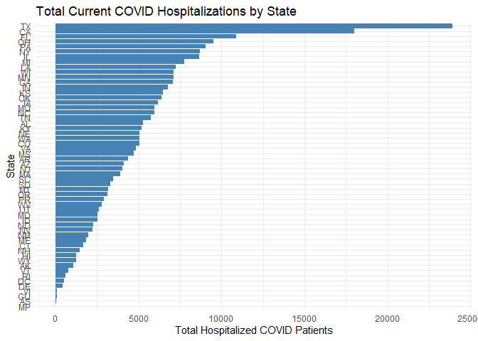
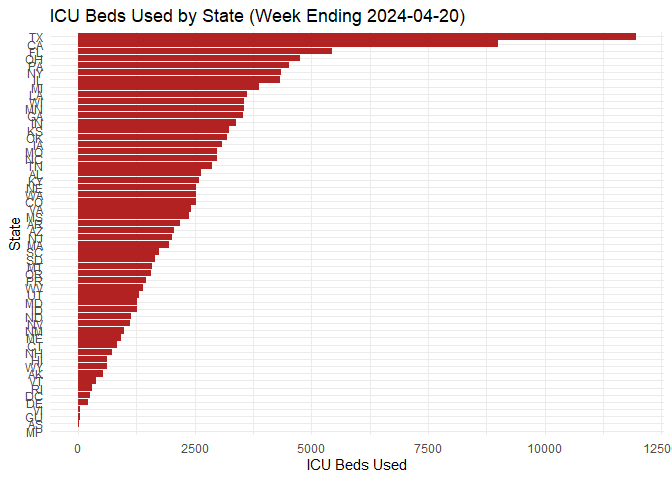
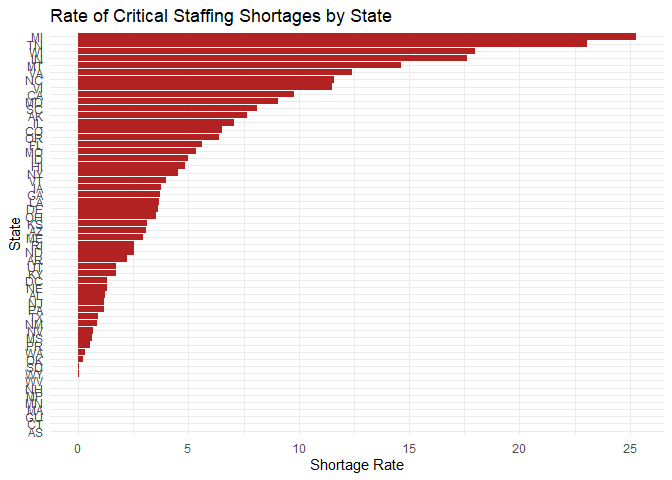
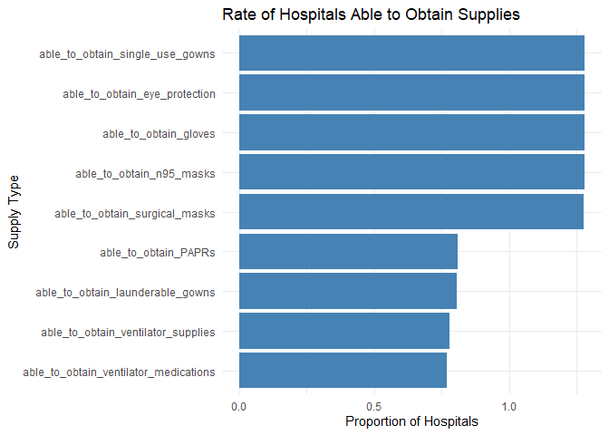

``` r
#Install Dependencies
library(tidyverse)
```

    ## ── Attaching core tidyverse packages ──────────────────────── tidyverse 2.0.0 ──
    ## ✔ dplyr     1.1.4     ✔ readr     2.1.5
    ## ✔ forcats   1.0.1     ✔ stringr   1.5.1
    ## ✔ ggplot2   4.0.0     ✔ tibble    3.3.0
    ## ✔ lubridate 1.9.4     ✔ tidyr     1.3.1
    ## ✔ purrr     1.1.0     
    ## ── Conflicts ────────────────────────────────────────── tidyverse_conflicts() ──
    ## ✖ dplyr::filter() masks stats::filter()
    ## ✖ dplyr::lag()    masks stats::lag()
    ## ℹ Use the conflicted package (<http://conflicted.r-lib.org/>) to force all conflicts to become errors

``` r
#Load the DataSet
hospital <- read_csv("Data/Hospitcal_Coverage.csv")
```

    ## Rows: 4852 Columns: 146
    ## ── Column specification ────────────────────────────────────────────────────────
    ## Delimiter: ","
    ## chr   (10): State, CCN, Facility Name, Street Address, City, Provider Subtyp...
    ## dbl  (135): Zip Code, Fips Code, Certified Bed Count, Component Hospitals, D...
    ## date   (1): Week Ending
    ## 
    ## ℹ Use `spec()` to retrieve the full column specification for this data.
    ## ℹ Specify the column types or set `show_col_types = FALSE` to quiet this message.

``` r
#Convert ZIP and Fips to character
hospital <- hospital |>
  mutate(
    `Zip Code` = as.character(`Zip Code`),
    `Fips Code` = as.character(`Fips Code`)
  )
```

``` r
#Replace empty strings with NA
hospital <- hospital |>
  mutate(
    across(where(is.character), ~ na_if(.x, ""))
  )
```

``` r
#Inspect columns
colnames(hospital)
```

    ##   [1] "State"                                                              
    ##   [2] "CCN"                                                                
    ##   [3] "Facility Name"                                                      
    ##   [4] "Street Address"                                                     
    ##   [5] "City"                                                               
    ##   [6] "Zip Code"                                                           
    ##   [7] "Fips Code"                                                          
    ##   [8] "Provider Subtype"                                                   
    ##   [9] "Reporting Source"                                                   
    ##  [10] "Dates with Missing Data"                                            
    ##  [11] "Certified Bed Count"                                                
    ##  [12] "Component Hospitals"                                                
    ##  [13] "Week Ending"                                                        
    ##  [14] "Days at 100%"                                                       
    ##  [15] "Percentage of Required Fields Reported"                             
    ##  [16] "Hospital Required to Report Wed Only"                               
    ##  [17] "County"                                                             
    ##  [18] "inpatient_beds"                                                     
    ##  [19] "all_adult_hospital_inpatient_beds"                                  
    ##  [20] "all_pediatric_inpatient_beds"                                       
    ##  [21] "inpatient_beds_used"                                                
    ##  [22] "all_adult_hospital_inpatient_bed_occupied"                          
    ##  [23] "all_pediatric_inpatient_bed_occupied"                               
    ##  [24] "total_icu_beds"                                                     
    ##  [25] "total_staffed_adult_icu_beds"                                       
    ##  [26] "total_staffed_pediatric_icu_beds"                                   
    ##  [27] "icu_beds_used"                                                      
    ##  [28] "staffed_adult_icu_bed_occupancy"                                    
    ##  [29] "staffed_pediatric_icu_bed_occupancy"                                
    ##  [30] "total_adult_patients_hospitalized_confirmed_covid"                  
    ##  [31] "total_pediatric_patients_hospitalized_confirmed_covid"              
    ##  [32] "staffed_icu_adult_patients_confirmed_covid"                         
    ##  [33] "staffed_icu_pediatric_patients_confirmed_covid"                     
    ##  [34] "previous_day_admission_adult_covid_confirmed"                       
    ##  [35] "previous_day_admission_adult_covid_confirmed_all"                   
    ##  [36] "previous_day_admission_pediatric_covid_confirmed"                   
    ##  [37] "previous_day_admission_peds_covid_confirmed_all"                    
    ##  [38] "total_patients_hospitalized_confirmed_influenza"                    
    ##  [39] "previous_day_admission_influenza_confirmed"                         
    ##  [40] "icu_patients_confirmed_influenza"                                   
    ##  [41] "n95_respirators_days_available"                                     
    ##  [42] "on_hand_supply_of_surgical_masks_in_days"                           
    ##  [43] "on_hand_supply_of_eye_protection_in_days"                           
    ##  [44] "on_hand_supply_of_single_use_surgical_gowns_in_days"                
    ##  [45] "on_hand_supply_of_gloves_in_days"                                   
    ##  [46] "able_to_maintain_n95_masks"                                         
    ##  [47] "able_to_maintain_surgical_masks"                                    
    ##  [48] "able_to_maintain_eye_protection"                                    
    ##  [49] "able_to_maintain_single_use_gowns"                                  
    ##  [50] "able_to_maintain_gloves"                                            
    ##  [51] "total_adult_patients_hospitalized_confirmed_and_suspected_covid"    
    ##  [52] "total_pediatric_patients_hospitalized_confirmed_and_suspected_covid"
    ##  [53] "inpatient_ventilators_used_covid"                                   
    ##  [54] "staffed_icu_adult_patients_confirmed_and_suspected_covid"           
    ##  [55] "hospital_onset_covid"                                               
    ##  [56] "previous_day_admission_adult_covid_suspected"                       
    ##  [57] "previous_day_admission_adult_covid_suspected_all"                   
    ##  [58] "previous_day_admission_pediatric_covid_suspected"                   
    ##  [59] "previous_day_total_ED_visits"                                       
    ##  [60] "previous_day_covid_ED_visits"                                       
    ##  [61] "total_adult_patients_hospitalized_confirmed_influenza"              
    ##  [62] "total_pediatric_patients_hospitalized_confirmed_influenza"          
    ##  [63] "previous_day_admission_adult_influenza_confirmed"                   
    ##  [64] "previous_day_admission_pediatric_influenza_confirmed"               
    ##  [65] "staffed_icu_adult_patients_confirmed_influenza"                     
    ##  [66] "staffed_icu_pediatric_patients_confirmed_influenza"                 
    ##  [67] "total_adult_patients_hospitalized_confirmed_rsv"                    
    ##  [68] "total_pediatric_patients_hospitalized_confirmed_rsv"                
    ##  [69] "previous_day_admission_adult_rsv_confirmed"                         
    ##  [70] "previous_day_admission_pediatric_rsv_confirmed"                     
    ##  [71] "staffed_icu_adult_patients_confirmed_rsv"                           
    ##  [72] "staffed_icu_pediatric_patients_confirmed_rsv"                       
    ##  [73] "critical_staffing_shortage_anticipated_within_week"                 
    ##  [74] "previous_day_admission_adult_covid_suspected_18-19"                 
    ##  [75] "previous_day_admission_adult_covid_suspected_20-29"                 
    ##  [76] "previous_day_admission_adult_covid_suspected_30-39"                 
    ##  [77] "previous_day_admission_adult_covid_suspected_40-49"                 
    ##  [78] "previous_day_admission_adult_covid_suspected_50-59"                 
    ##  [79] "previous_day_admission_adult_covid_suspected_60-69"                 
    ##  [80] "previous_day_admission_adult_covid_suspected_70-79"                 
    ##  [81] "previous_day_admission_adult_covid_suspected_80+"                   
    ##  [82] "previous_day_admission_adult_covid_suspected_unknown"               
    ##  [83] "previous_day_admission_adult_covid_confirmed_18-19"                 
    ##  [84] "previous_day_admission_adult_covid_confirmed_20-29"                 
    ##  [85] "previous_day_admission_adult_covid_confirmed_30-39"                 
    ##  [86] "previous_day_admission_adult_covid_confirmed_40-49"                 
    ##  [87] "previous_day_admission_adult_covid_confirmed_50-59"                 
    ##  [88] "previous_day_admission_adult_covid_confirmed_60-69"                 
    ##  [89] "previous_day_admission_adult_covid_confirmed_70-79"                 
    ##  [90] "previous_day_admission_adult_covid_confirmed_80+"                   
    ##  [91] "previous_day_admission_adult_covid_confirmed_unknown"               
    ##  [92] "previous_day_admission_pediatric_covid_confirmed_0_4"               
    ##  [93] "previous_day_admission_pediatric_covid_confirmed_5_11"              
    ##  [94] "previous_day_admission_pediatric_covid_confirmed_12_17"             
    ##  [95] "previous_day_admission_pediatric_covid_confirmed_unknown"           
    ##  [96] "total_beds"                                                         
    ##  [97] "all_adult_hospital_beds"                                            
    ##  [98] "total_ventilators"                                                  
    ##  [99] "ventilators_used"                                                   
    ## [100] "overflow_covid"                                                     
    ## [101] "overflow_ventilators_used_covid"                                    
    ## [102] "deaths_covid"                                                       
    ## [103] "previous_day_remdesivir_used"                                       
    ## [104] "on_hand_supply_remdesivir_vials"                                    
    ## [105] "critical_staffing_shortage_today"                                   
    ## [106] "staffing_shortage_details"                                          
    ## [107] "total_patients_hospitalized_confirmed_influenza_and_covid"          
    ## [108] "previous_day_deaths_influenza"                                      
    ## [109] "previous_day_deaths_covid_and_influenza"                            
    ## [110] "PPE_supply_management_source"                                       
    ## [111] "on_hand_ventilator_supplies_in_days"                                
    ## [112] "on_hand_supply_of_n95_respirators_in_units"                         
    ## [113] "on_hand_supply_of_PAPR_in_units"                                    
    ## [114] "on_hand_supply_of_surgical_masks_in_units"                          
    ## [115] "on_hand_supply_of_eye_protection_in_units"                          
    ## [116] "on_hand_supply_of_single_use_surgical_gowns_in_units"               
    ## [117] "on_hand_supply_of_launderable_surgical_gowns_in_units"              
    ## [118] "on_hand_supply_of_gloves_in_units"                                  
    ## [119] "able_to_obtain_ventilator_supplies"                                 
    ## [120] "able_to_obtain_ventilator_medications"                              
    ## [121] "able_to_obtain_n95_masks"                                           
    ## [122] "able_to_obtain_PAPRs"                                               
    ## [123] "able_to_obtain_surgical_masks"                                      
    ## [124] "able_to_obtain_eye_protection"                                      
    ## [125] "able_to_obtain_single_use_gowns"                                    
    ## [126] "able_to_obtain_gloves"                                              
    ## [127] "able_to_obtain_launderable_gowns"                                   
    ## [128] "able_to_maintain_ventilator_supplies"                               
    ## [129] "able_to_maintain_ventilator_medications"                            
    ## [130] "able_to_maintain_PAPRs"                                             
    ## [131] "able_to_maintain_lab_nasal_pharyngeal_swabs"                        
    ## [132] "able_to_maintain_lab_nasal_swabs"                                   
    ## [133] "able_to_maintain_lab_viral_transport_media"                         
    ## [134] "reusable_isolation_gowns_used"                                      
    ## [135] "reusable_PAPRs_or_elastomerics_used"                                
    ## [136] "reusable_n95_masks_used"                                            
    ## [137] "anticipated_medical_supply_medication_shortages"                    
    ## [138] "on_hand_supply_therapeutic_b_bamlanivimab_courses"                  
    ## [139] "previous_week_therapeutic_b_bamlanivimab_courses_used"              
    ## [140] "previous_week_personnel_covid_vaccinated_doses_administered"        
    ## [141] "total_personnel_covid_vaccinated_doses_none"                        
    ## [142] "total_personnel_covid_vaccinated_doses_one"                         
    ## [143] "total_personnel_covid_vaccinated_doses_all"                         
    ## [144] "total_personnel"                                                    
    ## [145] "previous_week_patients_covid_vaccinated_doses_one"                  
    ## [146] "previous_week_patients_covid_vaccinated_doses_all"

``` r
# Convert Week Ending to Date
hospital$`Week Ending` <- as.Date(hospital$`Week Ending`)

# Convert CCN to character (hospital ID)
hospital$CCN <- as.character(hospital$CCN)

# Convert Certified Bed Count to numeric
hospital$`Certified Bed Count` <- as.numeric(hospital$`Certified Bed Count`)

# Convert Days at 100% to numeric
hospital$`Days at 100%` <- as.numeric(hospital$`Days at 100%`)

# Convert Percentage of Required Fields Reported to numeric
hospital$`Percentage of Required Fields Reported` <- as.numeric(hospital$`Percentage of Required Fields Reported`)

# Convert the big block of obvious numeric columns
numeric_cols <- c(
  "inpatient_beds", "all_adult_hospital_inpatient_beds",
  "all_pediatric_inpatient_beds", "inpatient_beds_used",
  "all_adult_hospital_inpatient_bed_occupied",
  "all_pediatric_inpatient_bed_occupied", "total_icu_beds",
  "total_staffed_adult_icu_beds", "total_staffed_pediatric_icu_beds",
  "icu_beds_used", "staffed_adult_icu_bed_occupancy",
  "staffed_pediatric_icu_bed_occupancy",
  "total_adult_patients_hospitalized_confirmed_covid",
  "total_pediatric_patients_hospitalized_confirmed_covid",
  "staffed_icu_adult_patients_confirmed_covid",
  "staffed_icu_pediatric_patients_confirmed_covid",
  "previous_day_admission_adult_covid_confirmed",
  "previous_day_admission_adult_covid_confirmed_all",
  "previous_day_admission_pediatric_covid_confirmed",
  "previous_day_admission_peds_covid_confirmed_all",
  "total_patients_hospitalized_confirmed_influenza",
  "previous_day_admission_influenza_confirmed",
  "icu_patients_confirmed_influenza",
  "n95_respirators_days_available",
  "on_hand_supply_of_surgical_masks_in_days",
  "on_hand_supply_of_eye_protection_in_days",
  "on_hand_supply_of_single_use_surgical_gowns_in_days",
  "on_hand_supply_of_gloves_in_days"
)

hospital[numeric_cols] <- lapply(hospital[numeric_cols], as.numeric)

# Convert logical (Yes/No) supply/ability columns
logical_cols <- c(
  "able_to_maintain_n95_masks",
  "able_to_maintain_surgical_masks",
  "able_to_maintain_eye_protection",
  "able_to_maintain_single_use_gowns",
  "able_to_maintain_gloves"
)

hospital[logical_cols] <- lapply(hospital[logical_cols], as.logical)

hospital <- hospital |> mutate(`Week Ending` = as.Date(`Week Ending`))
```

``` r
#Save Cleaned Dataset
write_csv(hospital, "Data/cleaned_Hospital_Coverage.csv")
```

``` r
#Use Cleaned Dataset
hospital <- read_csv("Data/cleaned_Hospital_Coverage.csv")
```

    ## Rows: 4852 Columns: 146
    ## ── Column specification ────────────────────────────────────────────────────────
    ## Delimiter: ","
    ## chr   (10): State, CCN, Facility Name, Street Address, City, Provider Subtyp...
    ## dbl  (130): Zip Code, Fips Code, Certified Bed Count, Component Hospitals, D...
    ## lgl    (5): able_to_maintain_n95_masks, able_to_maintain_surgical_masks, abl...
    ## date   (1): Week Ending
    ## 
    ## ℹ Use `spec()` to retrieve the full column specification for this data.
    ## ℹ Specify the column types or set `show_col_types = FALSE` to quiet this message.

``` r
colnames(hospital)
```

    ##   [1] "State"                                                              
    ##   [2] "CCN"                                                                
    ##   [3] "Facility Name"                                                      
    ##   [4] "Street Address"                                                     
    ##   [5] "City"                                                               
    ##   [6] "Zip Code"                                                           
    ##   [7] "Fips Code"                                                          
    ##   [8] "Provider Subtype"                                                   
    ##   [9] "Reporting Source"                                                   
    ##  [10] "Dates with Missing Data"                                            
    ##  [11] "Certified Bed Count"                                                
    ##  [12] "Component Hospitals"                                                
    ##  [13] "Week Ending"                                                        
    ##  [14] "Days at 100%"                                                       
    ##  [15] "Percentage of Required Fields Reported"                             
    ##  [16] "Hospital Required to Report Wed Only"                               
    ##  [17] "County"                                                             
    ##  [18] "inpatient_beds"                                                     
    ##  [19] "all_adult_hospital_inpatient_beds"                                  
    ##  [20] "all_pediatric_inpatient_beds"                                       
    ##  [21] "inpatient_beds_used"                                                
    ##  [22] "all_adult_hospital_inpatient_bed_occupied"                          
    ##  [23] "all_pediatric_inpatient_bed_occupied"                               
    ##  [24] "total_icu_beds"                                                     
    ##  [25] "total_staffed_adult_icu_beds"                                       
    ##  [26] "total_staffed_pediatric_icu_beds"                                   
    ##  [27] "icu_beds_used"                                                      
    ##  [28] "staffed_adult_icu_bed_occupancy"                                    
    ##  [29] "staffed_pediatric_icu_bed_occupancy"                                
    ##  [30] "total_adult_patients_hospitalized_confirmed_covid"                  
    ##  [31] "total_pediatric_patients_hospitalized_confirmed_covid"              
    ##  [32] "staffed_icu_adult_patients_confirmed_covid"                         
    ##  [33] "staffed_icu_pediatric_patients_confirmed_covid"                     
    ##  [34] "previous_day_admission_adult_covid_confirmed"                       
    ##  [35] "previous_day_admission_adult_covid_confirmed_all"                   
    ##  [36] "previous_day_admission_pediatric_covid_confirmed"                   
    ##  [37] "previous_day_admission_peds_covid_confirmed_all"                    
    ##  [38] "total_patients_hospitalized_confirmed_influenza"                    
    ##  [39] "previous_day_admission_influenza_confirmed"                         
    ##  [40] "icu_patients_confirmed_influenza"                                   
    ##  [41] "n95_respirators_days_available"                                     
    ##  [42] "on_hand_supply_of_surgical_masks_in_days"                           
    ##  [43] "on_hand_supply_of_eye_protection_in_days"                           
    ##  [44] "on_hand_supply_of_single_use_surgical_gowns_in_days"                
    ##  [45] "on_hand_supply_of_gloves_in_days"                                   
    ##  [46] "able_to_maintain_n95_masks"                                         
    ##  [47] "able_to_maintain_surgical_masks"                                    
    ##  [48] "able_to_maintain_eye_protection"                                    
    ##  [49] "able_to_maintain_single_use_gowns"                                  
    ##  [50] "able_to_maintain_gloves"                                            
    ##  [51] "total_adult_patients_hospitalized_confirmed_and_suspected_covid"    
    ##  [52] "total_pediatric_patients_hospitalized_confirmed_and_suspected_covid"
    ##  [53] "inpatient_ventilators_used_covid"                                   
    ##  [54] "staffed_icu_adult_patients_confirmed_and_suspected_covid"           
    ##  [55] "hospital_onset_covid"                                               
    ##  [56] "previous_day_admission_adult_covid_suspected"                       
    ##  [57] "previous_day_admission_adult_covid_suspected_all"                   
    ##  [58] "previous_day_admission_pediatric_covid_suspected"                   
    ##  [59] "previous_day_total_ED_visits"                                       
    ##  [60] "previous_day_covid_ED_visits"                                       
    ##  [61] "total_adult_patients_hospitalized_confirmed_influenza"              
    ##  [62] "total_pediatric_patients_hospitalized_confirmed_influenza"          
    ##  [63] "previous_day_admission_adult_influenza_confirmed"                   
    ##  [64] "previous_day_admission_pediatric_influenza_confirmed"               
    ##  [65] "staffed_icu_adult_patients_confirmed_influenza"                     
    ##  [66] "staffed_icu_pediatric_patients_confirmed_influenza"                 
    ##  [67] "total_adult_patients_hospitalized_confirmed_rsv"                    
    ##  [68] "total_pediatric_patients_hospitalized_confirmed_rsv"                
    ##  [69] "previous_day_admission_adult_rsv_confirmed"                         
    ##  [70] "previous_day_admission_pediatric_rsv_confirmed"                     
    ##  [71] "staffed_icu_adult_patients_confirmed_rsv"                           
    ##  [72] "staffed_icu_pediatric_patients_confirmed_rsv"                       
    ##  [73] "critical_staffing_shortage_anticipated_within_week"                 
    ##  [74] "previous_day_admission_adult_covid_suspected_18-19"                 
    ##  [75] "previous_day_admission_adult_covid_suspected_20-29"                 
    ##  [76] "previous_day_admission_adult_covid_suspected_30-39"                 
    ##  [77] "previous_day_admission_adult_covid_suspected_40-49"                 
    ##  [78] "previous_day_admission_adult_covid_suspected_50-59"                 
    ##  [79] "previous_day_admission_adult_covid_suspected_60-69"                 
    ##  [80] "previous_day_admission_adult_covid_suspected_70-79"                 
    ##  [81] "previous_day_admission_adult_covid_suspected_80+"                   
    ##  [82] "previous_day_admission_adult_covid_suspected_unknown"               
    ##  [83] "previous_day_admission_adult_covid_confirmed_18-19"                 
    ##  [84] "previous_day_admission_adult_covid_confirmed_20-29"                 
    ##  [85] "previous_day_admission_adult_covid_confirmed_30-39"                 
    ##  [86] "previous_day_admission_adult_covid_confirmed_40-49"                 
    ##  [87] "previous_day_admission_adult_covid_confirmed_50-59"                 
    ##  [88] "previous_day_admission_adult_covid_confirmed_60-69"                 
    ##  [89] "previous_day_admission_adult_covid_confirmed_70-79"                 
    ##  [90] "previous_day_admission_adult_covid_confirmed_80+"                   
    ##  [91] "previous_day_admission_adult_covid_confirmed_unknown"               
    ##  [92] "previous_day_admission_pediatric_covid_confirmed_0_4"               
    ##  [93] "previous_day_admission_pediatric_covid_confirmed_5_11"              
    ##  [94] "previous_day_admission_pediatric_covid_confirmed_12_17"             
    ##  [95] "previous_day_admission_pediatric_covid_confirmed_unknown"           
    ##  [96] "total_beds"                                                         
    ##  [97] "all_adult_hospital_beds"                                            
    ##  [98] "total_ventilators"                                                  
    ##  [99] "ventilators_used"                                                   
    ## [100] "overflow_covid"                                                     
    ## [101] "overflow_ventilators_used_covid"                                    
    ## [102] "deaths_covid"                                                       
    ## [103] "previous_day_remdesivir_used"                                       
    ## [104] "on_hand_supply_remdesivir_vials"                                    
    ## [105] "critical_staffing_shortage_today"                                   
    ## [106] "staffing_shortage_details"                                          
    ## [107] "total_patients_hospitalized_confirmed_influenza_and_covid"          
    ## [108] "previous_day_deaths_influenza"                                      
    ## [109] "previous_day_deaths_covid_and_influenza"                            
    ## [110] "PPE_supply_management_source"                                       
    ## [111] "on_hand_ventilator_supplies_in_days"                                
    ## [112] "on_hand_supply_of_n95_respirators_in_units"                         
    ## [113] "on_hand_supply_of_PAPR_in_units"                                    
    ## [114] "on_hand_supply_of_surgical_masks_in_units"                          
    ## [115] "on_hand_supply_of_eye_protection_in_units"                          
    ## [116] "on_hand_supply_of_single_use_surgical_gowns_in_units"               
    ## [117] "on_hand_supply_of_launderable_surgical_gowns_in_units"              
    ## [118] "on_hand_supply_of_gloves_in_units"                                  
    ## [119] "able_to_obtain_ventilator_supplies"                                 
    ## [120] "able_to_obtain_ventilator_medications"                              
    ## [121] "able_to_obtain_n95_masks"                                           
    ## [122] "able_to_obtain_PAPRs"                                               
    ## [123] "able_to_obtain_surgical_masks"                                      
    ## [124] "able_to_obtain_eye_protection"                                      
    ## [125] "able_to_obtain_single_use_gowns"                                    
    ## [126] "able_to_obtain_gloves"                                              
    ## [127] "able_to_obtain_launderable_gowns"                                   
    ## [128] "able_to_maintain_ventilator_supplies"                               
    ## [129] "able_to_maintain_ventilator_medications"                            
    ## [130] "able_to_maintain_PAPRs"                                             
    ## [131] "able_to_maintain_lab_nasal_pharyngeal_swabs"                        
    ## [132] "able_to_maintain_lab_nasal_swabs"                                   
    ## [133] "able_to_maintain_lab_viral_transport_media"                         
    ## [134] "reusable_isolation_gowns_used"                                      
    ## [135] "reusable_PAPRs_or_elastomerics_used"                                
    ## [136] "reusable_n95_masks_used"                                            
    ## [137] "anticipated_medical_supply_medication_shortages"                    
    ## [138] "on_hand_supply_therapeutic_b_bamlanivimab_courses"                  
    ## [139] "previous_week_therapeutic_b_bamlanivimab_courses_used"              
    ## [140] "previous_week_personnel_covid_vaccinated_doses_administered"        
    ## [141] "total_personnel_covid_vaccinated_doses_none"                        
    ## [142] "total_personnel_covid_vaccinated_doses_one"                         
    ## [143] "total_personnel_covid_vaccinated_doses_all"                         
    ## [144] "total_personnel"                                                    
    ## [145] "previous_week_patients_covid_vaccinated_doses_one"                  
    ## [146] "previous_week_patients_covid_vaccinated_doses_all"

``` r
hospital |>
  group_by(State) |>
  summarize(
    total_covid = sum(
      total_adult_patients_hospitalized_confirmed_covid +
      total_pediatric_patients_hospitalized_confirmed_covid,
      na.rm = TRUE
    )
  ) |>
  ggplot(aes(x = reorder(State, total_covid), y = total_covid)) +
  geom_col(fill = "steelblue") +
  coord_flip() +
  labs(
    title = "Total Current COVID Hospitalizations by State",
    x = "State",
    y = "Total Hospitalized COVID Patients"
  ) +
  theme_minimal()
```

<!-- -->

``` r
hospital %>%
  mutate(
    covid_total = total_adult_patients_hospitalized_confirmed_covid +
                  total_pediatric_patients_hospitalized_confirmed_covid
  ) %>%
  ggplot(aes(x = State, y = covid_total)) +
  geom_boxplot(fill = "skyblue") +
  coord_flip() +
  labs(
    title = "Boxplot of COVID Hospitalizations by State",
    x = "State",
    y = "COVID Hospitalizations"
  ) +
  theme_minimal()
```

<!-- -->

``` r
hospital %>%
  group_by(State) %>%
  summarize(icu_used = sum(icu_beds_used, na.rm = TRUE)) %>%
  ggplot(aes(x = reorder(State, icu_used), y = icu_used)) +
  geom_col(fill = "firebrick") +
  coord_flip() +
  labs(
    title = "ICU Beds Used by State (Week Ending 2024-04-20)",
    x = "State",
    y = "ICU Beds Used"
  ) +
  theme_minimal()
```

<!-- -->

``` r
# Top 5 best-supplied states
best_states <- hospital %>%
  group_by(State) %>%
  summarize(avg_n95 = mean(n95_respirators_days_available, na.rm = TRUE)) %>%
  arrange(desc(avg_n95)) %>%
  slice(1:5)

best_states
```

    ## # A tibble: 5 × 2
    ##   State avg_n95
    ##   <chr>   <dbl>
    ## 1 AL          4
    ## 2 AS          4
    ## 3 CO          4
    ## 4 CT          4
    ## 5 DE          4

``` r
# Top 5 worst-supplied states
worst_states <- hospital %>%
  group_by(State) %>%
  summarize(avg_n95 = mean(n95_respirators_days_available, na.rm = TRUE)) %>%
  arrange(avg_n95) %>%
  slice(1:5)

worst_states
```

    ## # A tibble: 5 × 2
    ##   State avg_n95
    ##   <chr>   <dbl>
    ## 1 MP       0   
    ## 2 GU       3   
    ## 3 AK       3.32
    ## 4 WY       3.33
    ## 5 VI       3.5

``` r
hospital |>
  group_by(State) |>
  summarise(shortage_rate = mean(critical_staffing_shortage_today, na.rm = TRUE)) |>
  ggplot(aes(x = reorder(State, shortage_rate), y = shortage_rate)) +
  geom_col(fill = "firebrick") +
  coord_flip() +
  labs(
    title = "Rate of Critical Staffing Shortages by State",
    x = "State",
    y = "Shortage Rate"
  ) +
  theme_minimal()
```

<!-- -->

``` r
library(tidyverse)

obtain_vars <- hospital |>
  select(
    able_to_obtain_ventilator_supplies,
    able_to_obtain_ventilator_medications,
    able_to_obtain_n95_masks,
    able_to_obtain_PAPRs,
    able_to_obtain_surgical_masks,
    able_to_obtain_eye_protection,
    able_to_obtain_single_use_gowns,
    able_to_obtain_gloves,
    able_to_obtain_launderable_gowns
  ) |>
  pivot_longer(everything(), names_to = "supply", values_to = "available")

obtain_vars |>
  group_by(supply) |>
  summarise(rate = mean(available, na.rm = TRUE)) |>
  ggplot(aes(x = reorder(supply, rate), y = rate)) +
  geom_col(fill = "steelblue") +
  coord_flip() +
  labs(
    title = "Rate of Hospitals Able to Obtain Supplies",
    x = "Supply Type",
    y = "Proportion of Hospitals"
  ) +
  theme_minimal()
```

<!-- -->

``` r
maintain_vars <- hospital |>
  select(
    able_to_maintain_ventilator_supplies,
    able_to_maintain_ventilator_medications,
    able_to_maintain_PAPRs,
    able_to_maintain_lab_nasal_pharyngeal_swabs,
    able_to_maintain_lab_nasal_swabs,
    able_to_maintain_lab_viral_transport_media
  ) |>
  pivot_longer(everything(), names_to = "supply", values_to = "maintainable")

maintain_vars |>
  group_by(supply) |>
  summarise(rate = mean(maintainable, na.rm = TRUE)) |>
  ggplot(aes(x = reorder(supply, rate), y = rate)) +
  geom_col(fill = "darkgreen") +
  coord_flip() +
  labs(
    title = "Rate of Hospitals Able to Maintain Supplies",
    x = "Supply Type",
    y = "Proportion of Hospitals"
  ) +
  theme_minimal()
```

<!-- -->
